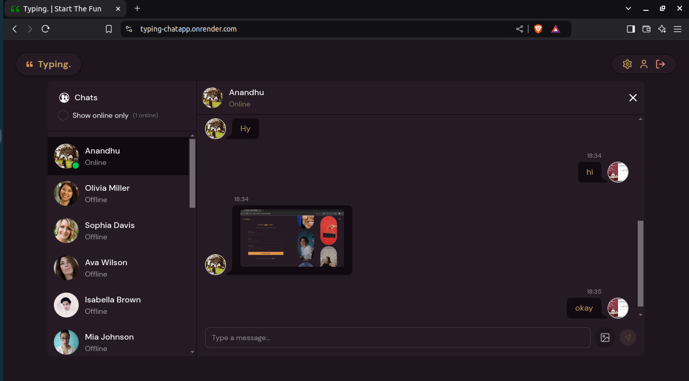
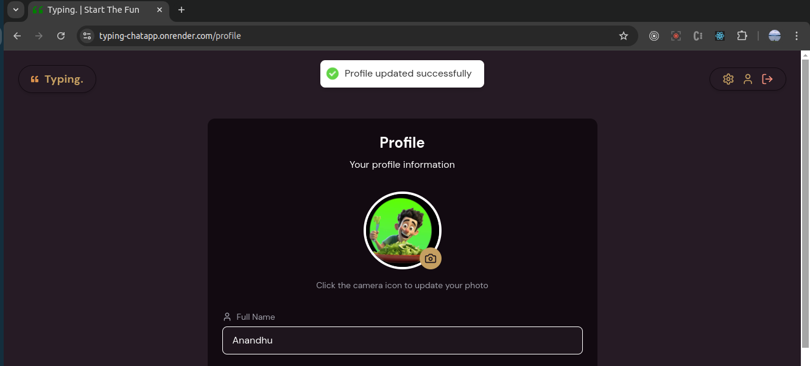
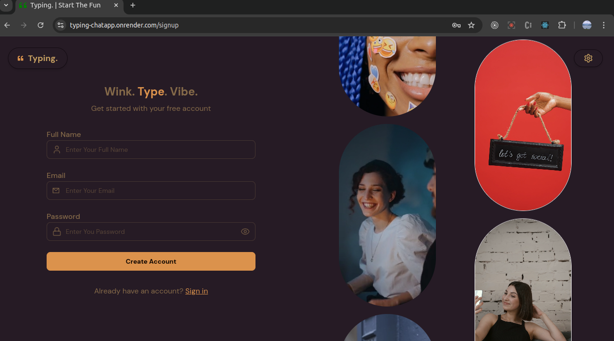

# Typing - Real-Time Chat App 🚀



## 🌐 Live Demo
🔗 [Typing Chat App](https://typing-chatapp.onrender.com/)

## 🛠 Tech Stack
- **Frontend:** React 19, Tailwind CSS v4, DaisyUI, Zustand, Framer Motion, Axios
- **Backend:** Node.js, Express.js, Socket.io, Mongoose
- **Database:** MongoDB
- **Authentication:** JSON Web Token (JWT), Bcrypt.js
- **File Uploads:** Cloudinary
- **UI Theme Customization:** DaisyUI Theme Generator

## 🚀 Features
✅ **Real-Time Messaging** with Socket.io  
✅ **Show Online Users** status  
✅ **DaisyUI Theme Customization**  
✅ **Send Images** in chat (via Cloudinary)  
✅ **User Authentication** (Signup/Login with JWT)  
✅ **Profile Picture Update**  
✅ **Only Registered Users Can Chat**  

## 📸 Screenshots
### 🔹 Chat Page


### 🔹 Profile Page


### 🔹 Signup Page


## 🛠 Installation & Setup

### 🔧 **Backend Setup**
1. Clone the repository:
   ```sh
   git clone https://github.com/anandhunv/typing-chatapp.git
